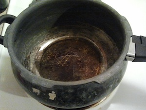
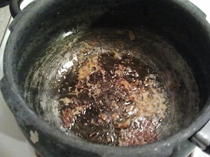
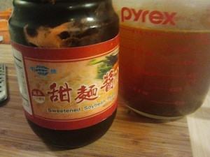
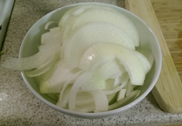
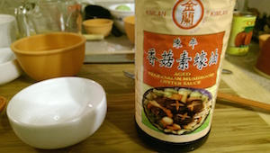
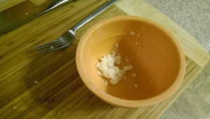

recipes
=======

Recipes, mostly vegetarian, borrowed or stolen.

Aloo Gobi (Cauliflower with Potatoes)
-------------------------------------

serves 6

<a href="#" onclick="hidepictures();" id="hider">simple view</a>

### ingredients

- 1 cauliflower
- 2 red potatoes
- a chunk of ginger (the size of a garlic clove)
- 1 tsp cumin seeds
- 1/4 tsp hing
- 1/2 tsp turmeric
- 2 tsp coriander power
- 1 tsp red chili power
- 1/2 tsp garam masa
- 2 tsp salt
- 2 tbsp semase oil
- some cilantro/coriander leaves

### steps

1. chop the cauliflower in half, break off the florets by hand, and cut big ones into a bite size.     
   
   
   

2. removes the eyes from the potatoes, cut them into a 1 cm cube (1/2 inch) with the skin on.     
   
   

3. peel and grate the ginger.     
   
   

4. heat semase oil in a pot with a thick bottom, and add cumin seeds.     
   
   
   

5. add hing and grated ginger, and mix well.     
   
   

6. add turmeric, coriander, and red chili poweder and stir.     
   

7. lower the heat to medium low, add cauliflower, potatoes, salt, and mix well.     
   

8. cover and cook for 7 min, shake vigorously with the cover on (or stir), and cook another 7 min.     
   

9. sprinkle garam masala, stir, cover, and cook for additional 5 min.

10. serve with chopped cilantro.     
    

### notes

this recipe is taken from [Sookhi Gobhi Aloo](http://madteaparty.wordpress.com/2007/11/30/sookhi-gobhi-aloo/).

Vegetarian Mapo Doufu
---------------------

serves 4

<a href="#" onclick="hidepictures();" id="hider">simple view</a>

### ingredients

- 4 scallions
- 2 cloves of garlic
- a chunk of ginger
- 1 cube of vegetable bouillon with 2 cups of water (or 2 cups of veg stock)
- 1 tbsp of tianmianjiang (sweetened soybean paste) or hoisin sauce
- 1 tbsp of sake
- 1 tsp of soy sauce
- 1 tbsp of doubanjiang (chili bean paste)
- 2 dried red chilies
- 2 tbsp of huajiao (sichuan pepper)
- 2 packs of silken tofu
- 1 pack (340 g) of vegetarian ground meat such as Smart Ground
- vegetable oil
- 2 tbsp of corn starch
- sesame oil

### steps

1. finely chop the scallions.     
   
   

2. peel garlic, equivalent amount of ginger, and grate them both.      
   
   

3. microwave water with the vegetable bouillon for 2 minutes, and crush the bouillon.     
   

4. add tianmianjiang, sake, and soy sauce to the soup base.     
   

5. set aside doubanjiang in a small bowl.    
   

6. finely chop red chilies into rings.    
   

7. grind huajiao using mortar and pestle.    
   
   

8. open Smart Ground from the package, and cut it half.     
   

9. open silken tofu packages, drain excess water, and cut them into 3 cm (1.2 inch) cubes.

10. heat a wok on medium high, add vegetable oil, and fry grated ginger, garlic and *half* of the scallions.    
    

11. once you start smelling the garlic (30 sec), make some room in the wok, and add in doubanjiang.     
    

12. let doubanjiang cook till the bottom changes color and sticks to the wok. (about 1 min) using ladle or spatula scrape the paste off the wok.

13. add Smart Ground to the wok, crush them into pieces, mix well, and let it cook until the bottom part is crisply browned.    
    
    

14. add soup base to the wok, mix well, and bring it to a boil.    
    

15. carefully slide in the tofu, gently mix them so they are covered in soup, drop the heat to medium low, and stew for 2 minutes.     
    

16. while tofu is cooking, mix cornstarch with equivalent amount of water, mix well and set aside.    
    

17. remove the tofu from heat, pour the cornstarch all around, and quickly mix it in.     
    

18. put the tofu on high heat till the soup comes to a simmer and thickens.

19. turn off the heat, and drizzle sesame oil all around.     
    
    

20. serve with the other half of the scallion and ground huajiao.     
    

### notes

getting the ingredients may be challenging for some of you. most of them should be available online or at a local specialty store or a super market:

- [The Organic Gourmet Low Sodium Vegetable Bouillon Cubes - 8 Cubes](http://www.amazon.com/dp/B0051ZJG4A/)
- [Ming Teh Sweetened Soybean Paste](http://posharpstore.com/en-us/ming-teh-food-sweetened-soybean-paste-p1494.aspx)
- [Lee Kum Kee Hoisin Sauce](http://www.amazon.com/dp/B0001DMTPU)
- [Gekkeikan Sake NV 750ml](http://www.amazon.com/dp/B0069DAMBY)
- [Kikkoman Naturally Brewed Less Sodium Soy Sauce](http://www.amazon.com/dp/B0051ONSPE/)
- [Shisen Toban Jan](http://www.amazon.com/dp/B00852YW7M)
- [Lee Kum Kee Chili Bean Sauce (Toban Djan)](http://www.amazon.com/dp/B0001WOSQY)
- [Szechuan Peppercorns](http://www.amazon.com/dp/B000EM6FV2)
- [Lite Silken Tofu](http://www.nasoya.com/products/tofu/lite-silken.html)
- [Smart Ground Original](http://www.lightlife.com/Vegan-Food-Vegetarian-Diet/Smart-Grounds-Original)
- [Kadoya Brand Sesame Oil 11 Oz.](http://www.amazon.com/dp/B002HMN6SC)

Meatless meat sauce
-------------------

serves 6?

<a href="#" onclick="hidepictures();" id="hider">simple view</a>

### ingredients

- 2 large or 3 small vidalia onions
- 3 cloves of garlic crushed and chopped
- 1 can of Cento San Marzano Peeled Tomatoes
- 1 can of Cento Tomato Paste 6oz
- 1 pack of Lightlife Smart Ground Original
- 2 tbsp of aged balsamic vineger
- 1 cup of water
- 1/4 cup of olive oil
- red chili flakes to taste
- 2 pinches of salt
- (pasta of your choice)
- (1 cup greek yogurt)
- (parmesan cheese)

### steps

1. start boiling water (not listed) for pasta.

2. cut the onions in half, and then slice them. 
   

3. in a large pot or Dutch oven, fry the onion with the olive oil until translucent. about 4 min.

4. add chopped garlic and Smart Ground crumbled with spatula into the pot, and mix well.

5. add balsamic vineger, salt and chili flakes and sauté them for a minute. 
   

6. empty the whole tomato into a bowl, and crush them by hand into bite size chunks.

7. add the crushed tomato with juice and tomato paste into the pot and mix well. 
   

8. add water into the pot and mix well. 
  

9. cook the sauce in medium heat for 7 minutes, stiring frequently.

10. follow the instruction to cook the pasta in plenty of water with a handful of sea salt.

I cooked stuffed shells, stuffed them with 1 tsp of greek yogurt each, and poured the sauce over. 

Sauted water spinach
--------------------

serves 2

<a href="#" onclick="hidepictures();" id="hider">simple view</a>

### ingredients

- 1 bunch of water spinach (kongxincai), cut into 3 inches (8cm)
- 1 clove of garlic, finely chopped
- 1/2 tsp red chili, cut in rings
- 1 tbsp vegetarian oyster sauce
- 1 tsp sugar
- 2 tbsp sake
- sesame
- sesame oil

### steps

water spinach (kongxincai) grows in muddy water, and is delicate to cold temperature of the fridge.
wash well after cutting it into smaller pieces. throw out any damaged stems or leaves. 

1. mix sugar and vegetarian oyster sauce in a small bowl. 
   

2. heat the wok, and put enough sesame oil to cover the surface.

3. fry garlic in the wok. 
   

4. put in the stem part of the water spinach with red chili, and stir fry for a minute on medium-high heat. 
   

5. put the rest of the water spinach. mix well to coat in oil.

6. put in sake, and increase the heat to cook off the alcohol.

7. put in the oyster sauce and mix.

8. serve with sesame on top. 
   
