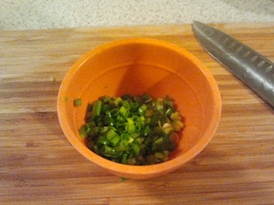
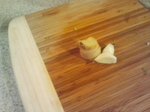
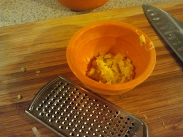
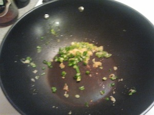
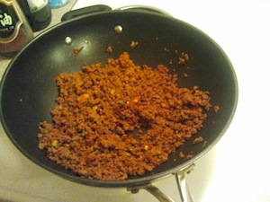
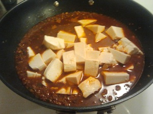
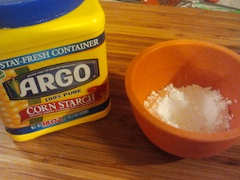
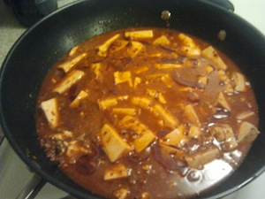

Vegetarian Mapo Doufu
---------------------

serves 4

### ingredients

- 4 scallions
- 2 cloves of garlic
- a chunk of ginger
- 1 cube of vegetable bouillon with 2 cups of water (or 2 cups of veg stock)
- 1 tbsp of tianmianjiang (sweetened soybean paste) or hoisin sauce
- 1 tbsp of sake
- 1 tsp of soy sauce
- 1 tbsp of doubanjiang (chili bean paste)
- 2 dried red chilies
- 2 tbsp of huajiao (sichuan pepper)
- 2 packs of silken tofu
- 1 pack (340 g) of vegetarian ground meat such as Smart Ground
- vegetable oil
- 2 tbsp of corn starch
- sesame oil

### steps

1. finely chop the scallions.     
   
   

2. peel garlic, equivalent amount of ginger, and grate them both.      
   
   

3. microwave water with the vegetable bouillon for 2 minutes, and crush the bouillon.     
   

4. add tianmianjiang, sake, and soy sauce to the soup base.     
   

5. set aside doubanjiang in a small bowl.    
   

6. finely chop red chilies into rings.    
   

7. grind huajiao using mortar and pestle.    
   
   

8. open Smart Ground from the package, and cut it half.     
   

9. open silken tofu packages, drain excess water, and cut them into 3 cm (1.2 inch) cubes.

10. heat a wok on medium high, add vegetable oil, and fry grated ginger, garlic and *half* of the scallions.    
    

11. once you start smelling the garlic (30 sec), make some room in the wok, and add in doubanjiang.     
    

12. let doubanjiang cook till the bottom changes color and sticks to the wok. (about 1 min) using ladle or spatula scrape the paste off the wok.

13. add Smart Ground to the wok, crush them into pieces, mix well, and let it cook until the bottom part is crisply browned.    
    
    

14. add soup base to the wok, mix well, and bring it to a boil.    
    

15. carefully slide in the tofu, gently mix them so they are covered in soup, drop the heat to medium low, and stew for 2 minutes.     
    

16. while tofu is cooking, mix cornstarch with equivalent amount of water, mix well and set aside.    
    

17. remove the tofu from heat, pour the cornstarch all around, and quickly mix it in.     
    

18. put the tofu on high heat till the soup comes to a simmer and thickens.

19. turn off the heat, and drizzle sesame oil all around.     
    
    

20. serve with the other half of the scallion and ground huajiao.     
    

### notes

getting the ingredients may be challenging for some of you. most of them should be available online or at a local specialty store or a super market:

- [The Organic Gourmet Low Sodium Vegetable Bouillon Cubes - 8 Cubes](http://www.amazon.com/dp/B0051ZJG4A/)
- [Ming Teh Sweetened Soybean Paste](http://posharpstore.com/en-us/ming-teh-food-sweetened-soybean-paste-p1494.aspx)
- [Lee Kum Kee Hoisin Sauce](http://www.amazon.com/dp/B0001DMTPU)
- [Gekkeikan Sake NV 750ml](http://www.amazon.com/dp/B0069DAMBY)
- [Kikkoman Naturally Brewed Less Sodium Soy Sauce](http://www.amazon.com/dp/B0051ONSPE/)
- [Shisen Toban Jan](http://www.amazon.com/dp/B00852YW7M)
- [Lee Kum Kee Chili Bean Sauce (Toban Djan)](http://www.amazon.com/dp/B0001WOSQY)
- [Szechuan Peppercorns](http://www.amazon.com/dp/B000EM6FV2)
- [Lite Silken Tofu](http://www.nasoya.com/products/tofu/lite-silken.html)
- [Smart Ground Original](http://www.lightlife.com/Vegan-Food-Vegetarian-Diet/Smart-Grounds-Original)
- [Kadoya Brand Sesame Oil 11 Oz.](http://www.amazon.com/dp/B002HMN6SC)

