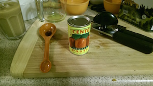

Meatless Meat Sauce
-------------------

serves 6?

<a href="#" onclick="hidepictures();" id="hider">simple view</a>

### ingredients

- 2 large or 3 small vidalia onions
- 3 cloves of garlic crushed and chopped
- 1 can of Cento San Marzano Peeled Tomatoes
- 1 can of Cento Tomato Paste 6oz
- 1 pack of Lightlife Smart Ground Original
- 2 tbsp of aged balsamic vineger
- 1 cup of water
- 1/4 cup of olive oil
- red chili flakes to taste
- 2 pinches of salt
- (pasta of your choice)
- (1 cup greek yogurt)
- (parmesan cheese)

### steps

1. start boiling water (not listed) for pasta.

2. cut the onions in half, and then slice them. 
   

3. in a large pot or Dutch oven, fry the onion with the olive oil until translucent. about 4 min.

4. add chopped garlic and Smart Ground crumbled with spatula into the pot, and mix well.

5. add balsamic vineger, salt and chili flakes and sauté them for a minute. 
   

6. empty the whole tomato into a bowl, and crush them by hand into bite size chunks.

7. add the crushed tomato with juice and tomato paste into the pot and mix well. 
   

8. add water into the pot and mix well. 
  

9. cook the sauce in medium heat for 7 minutes, stiring frequently.

10. follow the instruction to cook the pasta in plenty of water with a handful of sea salt.

I cooked stuffed shells, stuffed them with 1 tsp of greek yogurt each, and poured the sauce over. 

