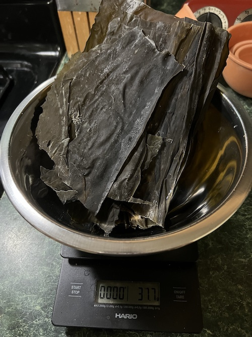

Vegan dashi
-----------

### ingredients for kombu dashi

- 3500ml of cold water
- 35g of dried kombu kelp (or 1% of water)

### (optional) ingredients for dried shiitake dashi

- 750ml of cold water
- 6 dried shiitake (about 38g)

### steps for kombu dashi

1. pour cold water into a large pot.
2. remove kombu parts that has other plants stuck to them, and add the rest to the pot in cold water.
3. let it sit at room temperature for 30 minutes.
4. heat the water at low heat for 20 minutes, targeting 60C or 140F.
5. stop the heat, let it cool, pour it into a thermos or a jug with kombu, and store refrigerated if you're not using in a day.

### steps for dried shiitake dashi

1. pour cold water into an air-tight container or a jar.
2. add dried shiitake.
3. let it sit overnight refrigerated, if you're not using it in a day.

### notes on kombu vs shiitake

Kombu dashi contains glutamates (glutamic acid), and is the basis of umami, savoriness.
Dried shiitake dashi contains guanylate (guanylic acid), which supposedly enhances the umami receptor by [30x](https://www.tandfonline.com/doi/epdf/10.1080/10408398309527364). Although shiitake dashi it tasty, it's overpowering so you should use less if you want kombu flavor to come forward in a soup, and more for stew that will be flavored by soy sauce, sugar (mirin is sugar) etc anyway.
