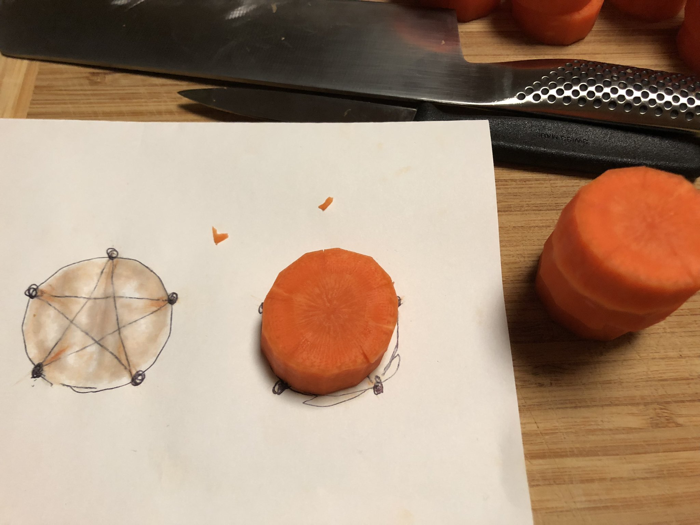
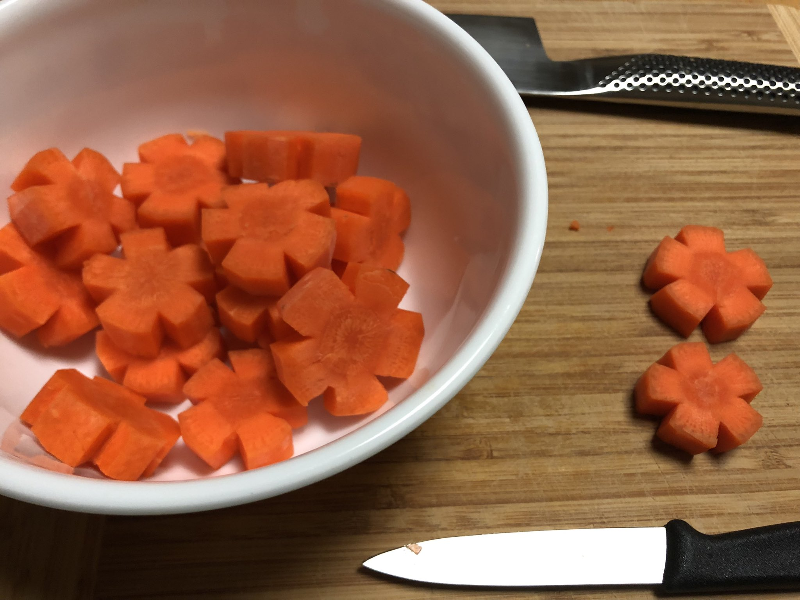
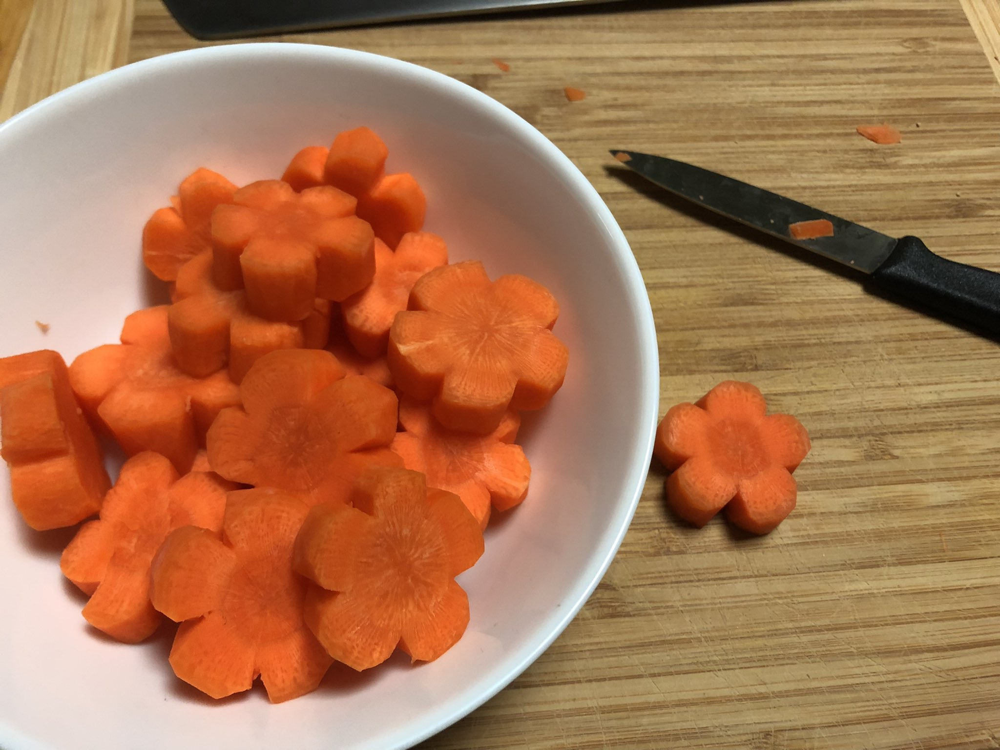
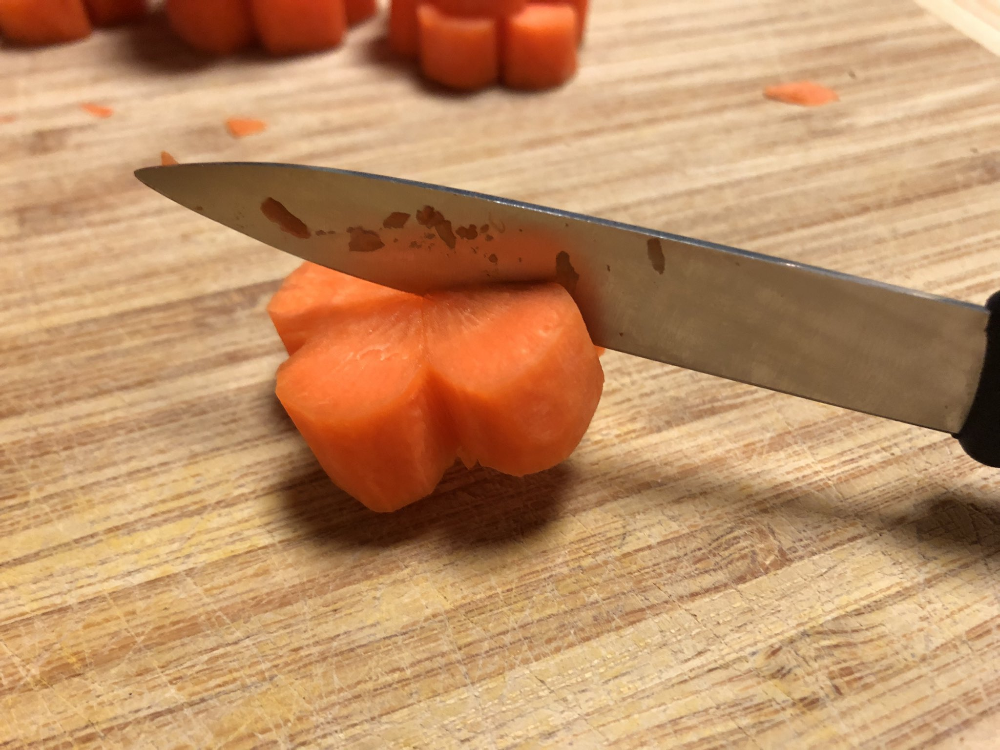
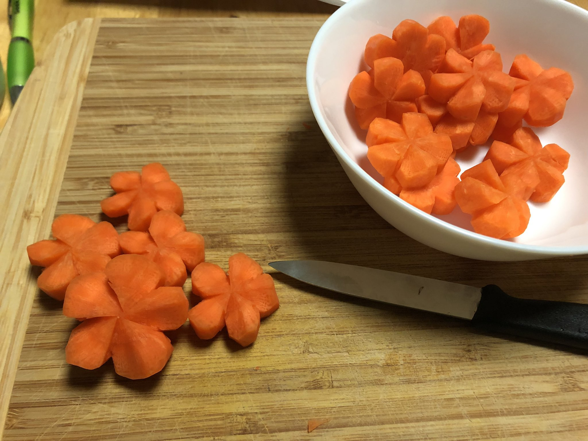

Nejiri ume: Plum blossom carrots
--------------------------------

Nejiri ume means a twisted plum blossom.

### ingredients

- large carrots

### steps

It goes fater if you go through the whole batch for each step.

1. Peel and cut carrots into 1cm (0.4 inch) thickness.

2. Using a template make 5 incisions, equally apart, 5mm deep. 
   

3. Make a v-shaped wedge around each incision. 
   

4. Round out the edges. 
   

5. Make 30° incision from the wedge to the center. 
   

6. From the midline of each petal make a slant cut towards the other cut. 
   

### notes

This is a traditional cutting technique, but the credit for the steps goes to <https://cookpad.com/recipe/1531299>, originally written in Japanese.

The cultural significance of plum blossom is that it's often the first flower to bloom in the middle of winter. Thus in China it has symbolized the arrival of hope and spring. The tradition of admiring the blossom was ported to Japan, but cherry blossom became more popular later on.
