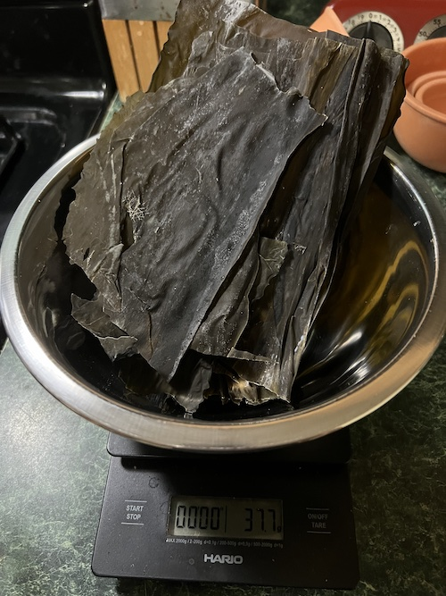

精進 (ヴィーガン) だし
-------------------

### 昆布だしの材料

- 冷水 3500ml
- 昆布 35g (水の 1%)

### 椎茸だしの材料

- 冷水 750ml
- 干し椎茸 6つ (約38g)

### 昆布だしの手順

1. 大きめの鍋に冷水を注ぐ
2. 昆布に他の植物などがこびりついている部分は切り取って捨て、昆布はそのまま冷水に入れる。
3. 室温で 30分待つ。
4. 60C を目安に弱火で 20分ほど加熱する。
5. 火を止め、ゆっくりと冷まして、昆布といっしょに魔法瓶もしくは麦茶ポットに移し替えて、今日のうち使わないならば冷蔵庫にて保存する。

### 椎茸だしの手順

1. タッパーもしくは瓶に冷水を注ぐ。
2. 干し椎茸を入れる。
3. 今日のうち使わないならば、冷蔵庫で一晩寝かす。

### 昆布だしと椎茸だしについて

昆布だしはグルタミン酸を含む、うま味の基本となる。
椎茸だしはグアニン酸を含み、うま味の受容体を[30倍](https://www.tandfonline.com/doi/epdf/10.1080/10408398309527364)強力にするらしい。椎茸だしは美味しいが、昆布だしの風味を乗っ取ってしまうので汁物など昆布だしを前に出したい場合は控えめに使い、煮物など醤油や砂糖が入る場合は多めの割合で混ぜて使う。
